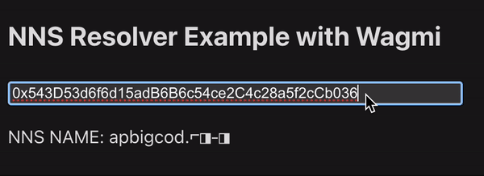

# Example: Using `@nnsprotocol/resolver-wagmi` in a React app

This example demonstrates how to integrate the `@nnsprotocol/resolver-wagmi` package in a React application. Here, you'll see how to use the `useNnsName` hook to resolve `.⌐◨-◨` domains with an automated fallback to `.eth` names in a simple [Vite](https://vitejs.dev) project.

## Prerequisites

Before you begin, ensure you have the following installed:

- [Node.js](https://nodejs.org/) or [Bun](https://bun.sh)
- A package manager like [npm](https://www.npmjs.com/), [yarn](https://yarnpkg.com/), [pnpm](https://pnpm.io/), or [bun](https://bun.sh/)

## Getting Started

1. **Clone the Repository**

   If you haven't already, start by cloning the main repository or download the example folder directly.

   ```bash
   git clone https://github.com/@nnsprotocol/resolver.git
   ```

2. **Navigate to the Example Directory**

   Change your current directory to the `examples/wagmi` folder.

   ```bash
   cd resolver/examples/wagmi
   ```

3. **Install Dependencies**

   Install the necessary dependencies using your package manager.

   ```bash
   npm install
   # or
   yarn install
   # or
   pnpm install
   # or
   bun install
   ```

## Running the Example

After installing the dependencies, you can start the example application to see the `useNnsName` hook in action.

```bash
npm run dev
# or
yarn run dev
# or
pnpm run dev
# or
bun run dev
```

Open your browser and navigate to the address provided in your terminal (`http://localhost:5173`). You should now see the example application running which should look like:



You can change the address and see the name being resolved.

## Understanding the Code

In the example, `useNnsName` is used to resolve an NNS name from a given Ethereum address:

```ts
import { useNnsName } from '@nnsprotocol/resolver-wagmi'

function App() {
  const result = useNnsName({
    address: "0x543D53d6f6d15adB6B6c54ce2C4c28a5f2cCb036"
  })

  // The resolved data is available in result.data
  console.log(result.data)
}

export default App;
```

Here, `useNnsName` makes it straightforward to resolve NNS names, offering a simple and intuitive API that fits seamlessly into your wagmi-based projects.


## Feedback and Contributions

Your feedback and contributions are welcome! If you have suggestions or encounter any issues, please open an issue or submit a pull request in the main repository.